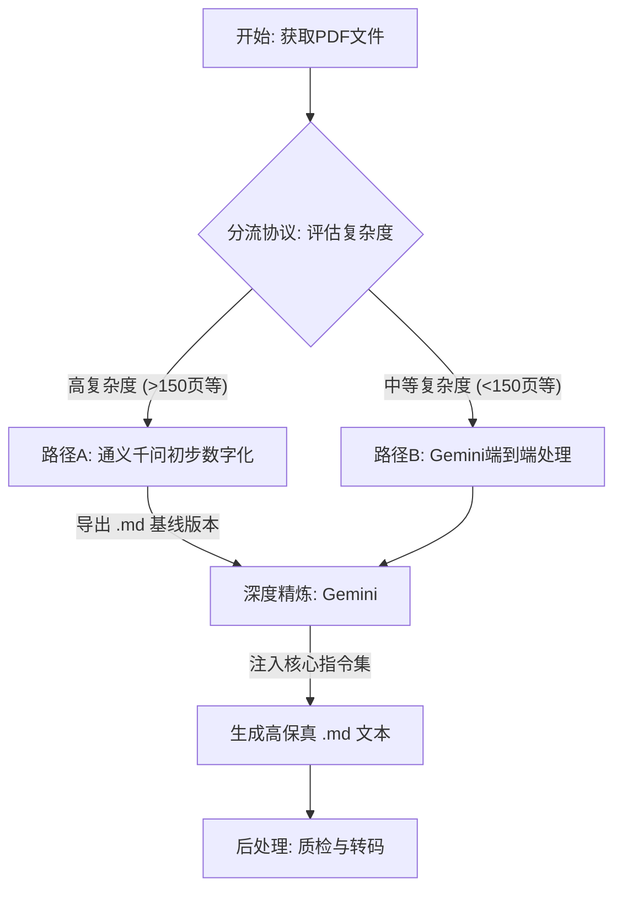

# 数字化知识重生计划 (Digital Knowledge Rebirth Project)

[](./LICENSE)
[](https://t.me/ProjectDigitalEternity)
[](https://github.com/fud114514/AI-OCR-BOOK/issues)
[](https://github.com/fud114514/AI-OCR-BOOK/commits/main)

**一个基于AI的知识工程项目，致力于将静态的扫描版文档，通过自动化处理管线，转化为动态、可计算且语义丰富的结构化知识库。**

---

## 📖 项目愿景 (Project Vision)

大量的学术文献、历史档案及绝版书籍，当前仅以非结构化的扫描PDF格式固化，形成了难以逾越的“信息孤岛”（Information Silos）。其内含的知识价值因无法被现代计算范式有效索引、解析或复用而受到极大限制。

本项目的核心愿景在于**打破这些数字壁垒，实现知识的“计算再生”**。我们构建了一个集成了**高保真光学字符识别（High-Fidelity OCR）**与**大语言模型（LLM）**的自动化处理管线（Pipeline），旨在对原始图像数据进行深度的**文本萃取、语义解析、结构化重构与内容精炼**。其最终目标是，将每一份静态文档转化为一个动态、可计算、且语义丰富的Markdown知识实体，赋能下游的知识图谱构建、学术研究与二次开发。

---

## 🔬 方法论与标准化作业规程 (Methodology & SOP)

本节详细阐述了用于生成本库内所有文档的标准化作业规程（Standard Operating Procedure, SOP）。此方法论旨在为数字人文（Digital Humanities）及知识工程领域的研究者与实践者，提供一套可复现、可扩展的技术路径。

#### 核心技术栈 (Core Technology Stack)

1.  **通义千问 (Tongyi)**
    *   **网址**: `https://www.tongyi.com/read`
    *   **角色定位**: **大规模文档预处理器 (Large-Scale Document Pre-processor)**。专用于对高复杂度、大体量的扫描PDF进行初始的版面分析（Layout Analysis）与文本数字化，为后续的精炼流程提供基线数据。

2.  **Gemini**
    *   **网址**: `https://aistudio.google.com/`
    *   **角色定位**: **核心语义处理与重构引擎 (Core Semantic Processing & Restructuring Engine)**。负责执行计算密集型的高阶自然语言处理（NLP）任务，包括但不限于上下文纠错、语义结构化以及基于特定规则的自动化重构。

3.  **Pandoc**
    *   **网址**: `https://pandoc.org/`
    *   **角色定位**: **通用文档转码器 (Universal Document Converter)**。作为功能强大的命令行工具，用于将经过验证的Markdown源文件精确地转码为EPUB等多种发布格式，是连接内容与发布的桥梁。

#### 完整处理管线 (The Processing Pipeline)

我们的流程是一个基于文档复杂度评估的决策系统，旨在优化计算资源并确保最高处理质量。

##### **第一步：文档分流协议 (Triage Protocol)**

此初始步骤对于优化资源分配和确保处理稳定性至关重要。

*   **路径 A (双阶段管线)**:
    *   **适用对象**: 具备高复杂度指标的文档，如**页数极大**（>150页）、**版式多栏混排**或**OCR信噪比低**。
    *   **决策逻辑**: 规避单次处理可能引发的计算资源瓶颈与内容截断风险。“通义千问”作为预处理器，确保了大规模数字化任务的稳定性与完整性。

*   **路径 B (单阶段管线)**:
    *   **适用对象**: 复杂度指标适中的文档，如**页数可控**（<150页）、**版式统一**且**文本清晰**。
    *   **决策逻辑**: Gemini的多模态输入能力足以应对此类任务，简化流程以提升效率。

##### **第二步：执行路径 (Execution Pathways)**

**路径 A：针对高复杂度文档的双阶段管线**

1.  **初始数字化 (通义千问)**: 上传高复杂度PDF至 `tongyi.com/read`，执行其内置OCR与版面分析，最终导出Markdown（`.md`）基线版本。
2.  **深度语义精炼 (Gemini)**: 将 `.md` 基线版本的全部内容复制到 `aistudio.google.com/`，并注入下述核心指令集进行高级重构。

**路径 B：针对中等复杂度文档的单阶段管线**

1.  **一体化处理 (Gemini)**: 在 `aistudio.google.com/` 直接上传中等复杂度PDF，并注入下述核心指令集进行端到端的处理。

##### **处理流程决策图**


##### **第三步：指令工程与专家系统模拟 (Prompt Engineering & Expert System Simulation)**

这是决定输出质量与一致性的**核心控制机制**。我们为Gemini设计并开源了两套标准化的“专家角色”指令集。这些指令不仅是简单的命令，更是一套详尽的规则集，它将Gemini配置为一个遵循特定规范的“数字人文处理专家”，从而确保了处理结果的高度一致性和专业性。

*   **[📄 Standard Prompt - 标准处理指令](Standard%20OCR%20Post-processing%20and%20Markdown%20Structuring%20Prompt.md)**: 
    *   **用途**: 适用于大多数常规文档的处理，执行全面的校对、格式化和基础重构任务。

*   **[📄 Expert Prompt - 专家级处理指令](Expert-level%20OCR%20Post-processing%20and%20Markdown%20Structuring%20Prompt.md)**: 
    *   **用途**: 针对包含复杂元素（如词典、哲学论述、专业术语表）的文档，执行更深度的语义重构，如“词条化重构”和“标题注解合并”。

##### **第四步：后处理与多格式交付物生成 (Post-Processing & Multi-Format Deliverable Generation)**

1.  **4.1 质量保证 (Quality Assurance - QA)**:
    *   AI生成的Markdown文本必须经过严格的人工抽样审核。此步骤旨在验证结构完整性（如章节层级是否正确）、关键术语准确性及格式合规性（如列表、代码块是否正确渲染），确保其达到可发布的标准。

2.  **4.2 格式转码 (Format Transcoding with Pandoc)**:
    *   在QA通过后，我们采用 **Pandoc** 这一强大的命令行工具，将最终的 `.md` 源文件转码为 `.epub` 格式。
    *   **为何选择Pandoc?**: Pandoc提供了无与伦比的灵活性和控制力，能够精确处理元数据（书名、作者）、目录生成和字体嵌入，确保生成的EPUB文件具有专业出版物的水准。
    *   **概念性命令示例**:
        ```bash
        pandoc "Your_Book_Title.md" -o "Your_Book_Title.epub" --metadata title="完整的书籍标题" --metadata author="作者姓名" --toc
        ```
    *   此命令将一个Markdown文件转换为带有元数据和自动生成目录的EPUB文件，这是实现高质量电子书的最后关键一步。

---

## 📚 成果交付物 (Deliverables)

本仓库为每部典籍提供两种标准格式的交付物：

*   **`.md` (Markdown - 结构化源文本)**
    *   **应用场景**: 作为规范化的（Canonical）源数据，适用于**数据挖掘、计算语言学分析、知识图谱注入、及个人知识管理系统（PKM）集成**。

*   **`.epub` (EPUB - 优化阅读格式)**
    *   **应用场景**: 作为标准电子出版物，其可重排（Reflowable）文本专为在各类电子阅读终端上实现**最佳自适应版式与沉浸式阅读体验**而设计。

## ✨ 技术优势 (Technical Advantages)

*   **高保真度 (High Fidelity)**: 通过LLM驱动的上下文纠错机制，显著降低了传统OCR的字符错误率（Character Error Rate, CER）。
*   **语义结构化 (Semantic Structuring)**: 将扁平的文本流转化为机器可读的、具有内在逻辑层级的知识结构。
*   **双模态可用性 (Dual-Modality Availability)**: 提供`.md`源文件以支持数据分析，同时提供`.epub`格式以优化人类阅读体验。
*   **增强的可访问性与互操作性 (Enhanced Accessibility & Interoperability)**: 结构化文本极大提升了内容的可发现性（Discoverability），并能无缝集成至各类知识管理系统与数据处理管线。
*   **内容纯化 (Content Purification)**: 通过程序化移除页眉、页脚等版式噪声，提供专注于核心知识内容的纯净文本。

## 🤝 社区贡献与协作 (Contribution & Collaboration)

我们欢迎并感谢社区的任何形式的贡献。

#### 1. 加入技术交流
*   我们设立了一个Telegram群组，用于讨论文档处理技术、分享相关资源及优化工作流。
*   **点击链接加入: [Project Digital Eternity on Telegram](https://t.me/ProjectDigitalEternity)**

#### 2. 提交勘误
*   若发现文本或格式错误，请通过[**提交一个Issue**](https://github.com/fud114514/AI-OCR-BOOK/issues/new/choose)进行反馈。
*   请在Issue中详细说明**书籍名称**、**文件格式**、**具体位置**及**修正建议**。

#### 3. 提名处理对象
*   欢迎通过Issue提名具有重要价值的扫描版文档，以纳入我们的处理队列。

## ⚠️ 免责声明 (Disclaimer)

*   **版权**: 本仓库所有内容均来自公开互联网资源，其数字化重构仅用于学术研究与个人学习。我们坚决尊重版权。若任何内容侵犯您的权益，请联系我们立即移除。
*   **准确性**: 我们追求最高准确性，但无法保证100%无误。所有内容请以原版为最终依据。

## 📄 许可协议 (License)

本项目产出的重构内容采用 **[CC BY-NC-SA 4.0](https://creativecommons.org/licenses/by-nc-sa/4.0/deed.zh)** 许可协议，要求**署名**、**非商业性使用**和**相同方式共享**的原则。
